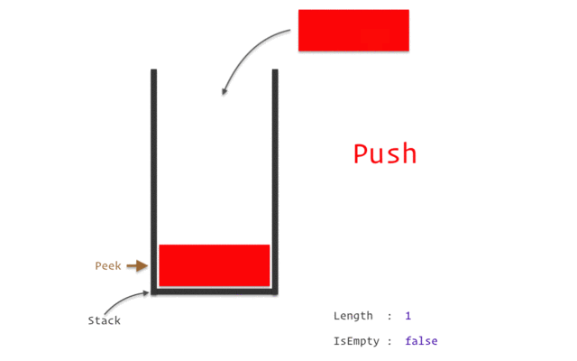

# Stack(스택)

## Stack(스택)이란?

 - 한 쪽 끝에서만 자료를 넣거나 뺄 수 있는 선형 자료구조
 - **LIFO(Last In First Oout)연산** 선형구조로 되어 있다; 가장 마지막에 push된 값이 가장 처음 pop된다.
 

[^출처]

## Stack(스택) 구현
Stack(스택) 구현 시 다음의 메소드들은 꼭 필요하다.

 1. **push(data) = 삽입** : data를 stack에 push(삽입)한다. 즉, data를 stack array나 stack linked list의 node로 집어 넣는 것이다. push operation이 일어나면 top(stack의 가장 최근 data; 가장 마지막으로 push된 data)은 top + 1이 된다.
 2. **pop() = 삭제** : 가장 마지막(최근)에 push되었던 data를 stack에서 pop(삭제)한다; stack array나 stack linked list에 존재하는 data(node)를 빼 내는 것이다. pop 연산이 일어나면 top은 top - 1이 된다.
 3. **peek() = top값 반환** : stack array나 stack linked list의 가장 최근 data를 반환한다; top()이라고도 많이 쓰인다.
 
추가적으로 stack이 비었는지 차있는지 확인해주는 is_empty()메소드와 같이, 상황에 맞게 만들어진 사용자 정의 메소드들이 많이 쓰인다.

## Stack(스택) array 구현 코드 (C++)

~~~c
#include <iostream>

template <typename T>
class Stack {
private:
	T *data; // 데이터 배열(arr)
	int capacity; // 스택의 크기
	int top_idx; // 스택 맨 위 인덱스 = 제일 최근 인덱스
	
public:
	//생성자
	Stack(int capacity = 1000) : data(new T[capacity]), capacity(capacity), top_idx(-1) {}
	
	//소멸자
	~Stack() {delete[] data;}
	
	void push(T value) {
		if(!is_full())
			this->data[++(this->top_idx)] = value;
		else
			std::cout << "Stack is full." << std::endl;
	}
	
	T pop() {
		if(this->top_idx != -1)
			return this->data[(this->top_idx)--];
		else
			return this->top_idx; //std::cout << "Stack is empty." << std::endl;
	}
	
	int size() {
		return (this->top_idx)+1;
	}
	
	bool is_empty() {
		return (this->top_idx == -1) ? true : false;
	}
	
	T top() {
		return (this->top_idx == -1) ? -1 : this->data[this->top_idx];
	}
	
	bool is_full() {
		return (this->top_idx == this->capacity) ? true : false;
	}
	
	friend std::ostream& operator <<(std::ostream &out, Stack<T> &stack){
		T *temp = stack.data;
		out << "┌───┐" << std::endl;
		for(int i = stack.top_idx; i >= 0; --i){
			out << "  " << temp[i] << std::endl;
		}
		out << "└───┘" << std::endl;
		return out;
	}
};

int main() {
	std::ios::sync_with_stdio(false);
	std::cin.tie(NULL); 
	std::cout.tie(NULL);
	
	Stack<int> stack;
	
	std::cout << "Stack push" << std::endl;
	stack.push(1);
	std::cout << stack << std::endl;
	
	std::cout << "Stack push" << std::endl;
	stack.push(2);
	std::cout << stack << std::endl;
	
	std::cout << "Stack push" << std::endl;
	stack.push(3);
	std::cout << stack << std::endl;
	
	std::cout << "Stack size : " << stack.size() << std::endl;
	std::cout << "Stack top : " << stack.top() << std::endl;
	
	std::cout << "Stack pop : " << stack.pop() << std::endl;
	std::cout << stack << std::endl;
	
	std::cout << "Stack pop : " << stack.pop() << std::endl;
	std::cout << stack << std::endl;
	
	std::cout << "Stack pop : " << stack.pop() << std::endl;
	std::cout << stack << std::endl;
	
	return 0;
}
~~~

## Stack(스택) linked list 구현 코드 (C++)

~~~c
#include <iostream>

template <typename T>
struct Node {
	T data;
	struct Node *next;
};

template <typename T>
class Stack {
private:
	Node<T> *head;
	Node<T> *tail;
	
public:
	Stack() : head(nullptr), tail(nullptr) {}
	
	~Stack() {
		if (this->head == nullptr)
			return;
		
		Node<T> *cur = this->head;
		
		while (cur != nullptr) {
			cur = cur->next;
			delete this->head;
			this->head = cur;
		}
		
		this->tail = this->head;
	}
	
	bool is_empty() {
		return this->head == nullptr ? true : false;
	}
	
	void push(T value) {
		Node<T> *node = new Node<T>;
		node->next = nullptr;
		node->data = value;
		
		if (this->head == nullptr)
			this->head = node;
		else
			this->tail->next = node;

		this->tail = node;
	}
	
	T pop() {
		Node<T> *cur = this->head;
		T value = this->is_empty() ? -1 : this->head->data; // error code 정의 ex) -1
		
		if (this->head == this->tail) { // 1 element
			delete this->head;
			this->head = this->tail = nullptr;
		}
		else {
			value = this->tail->data;
			
			while(cur->next != this->tail) // > 1 elements
				cur = cur->next;
			
			delete this->tail;
			
			cur->next = nullptr;
			this->tail = cur;
		}
		
		return value;
	}
	
	T top() {
		return this->tail == nullptr ? -1 : this->tail->data;
	}
	
	int size() {
		Node<T> *cur = this->head;
		int count = 0;
		
		while(cur != nullptr) {
			cur = cur->next;
			++count;
		}
		
		return count;
	}
	
	friend std::ostream& operator <<(std::ostream &out, Stack<T> &stack){
		Node<T> *temp = stack.head;
		out << "┌───┐" << std::endl;
		while(temp != nullptr) {
			out << "| " << temp->data << " |" << std::endl;
			temp = temp->next;
		}
		return out;
	}	
};

int main() {
	std::ios::sync_with_stdio(false);
	std::cin.tie(NULL); 
	std::cout.tie(NULL);
	
	Stack<int> stack;
	
	std::cout << "Stack push" << std::endl;
	stack.push(1);
	std::cout << stack << std::endl;
	
	std::cout << "Stack push" << std::endl;
	stack.push(2);
	std::cout << stack << std::endl;
	
	std::cout << "Stack push" << std::endl;
	stack.push(4);
	std::cout << stack << std::endl;
	
	std::cout << "Stack size : " << stack.size() << std::endl;
	std::cout << "Stack top : " << stack.top() << std::endl;
	
	std::cout << "Stack pop : " << stack.pop() << std::endl;
	std::cout << stack << std::endl;
	
	std::cout << "Stack pop : " << stack.pop() << std::endl;
	std::cout << stack << std::endl;
	
	std::cout << "Stack pop : " << stack.pop() << std::endl;
	std::cout << stack << std::endl;
	
	return 0;
}
~~~

[^출처]: https://medium.com/@1991dharapatel/javascript-stacks-and-queues-136fabab8359
