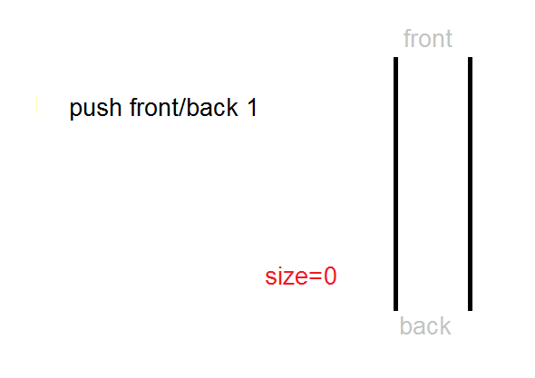

# Deque(덱) : Double Ended Queue

## Deque(덱)이란?

 - **양쪽 끝에서 삽입과 삭제가 모두 가능**한 자료 구조
 - Stack(스택)과 Queue(큐)를 합친 형태라고 볼 수 있다.
 

출처[^1]

[^1]: https://commons.wikimedia.org/wiki/File:Deque.gif

## Deque(덱) 구현
Deque(덱) 구현 시 다음의 메소드들은 꼭 필요하다.

 1. **push_front(data) = 앞에 삽입** : data node를 deque(덱)의 제일 앞에 push(삽입)한다.
 2. **push_back(data) = 뒤에 삽입** : data node를 deque(덱)의 제일 뒤에 push(삽입)한다.
 2. **pop_front() = 선두 삭제** : deque(덱)의 front(head) node를 pop(삭제)하고, 가장 앞에 있는 node를 front(head) node로 지정한다.
 2. **pop_back() = 후미 삭제** : deque(덱)의 rear(tail) node를 pop(삭제)하고, 가장 뒤에 있는 node를 rear(tail) node로 지정한다.
 
추가적으로 deque(덱)이 비었는지 차있는지 확인해주는 is_empty()메소드와, front(head) & rear(tail) node의 data를 반환해주는 get_front() & get_rear()메소드들과 같이, 상황에 맞게 만들어진 사용자 정의 메소드들이 많이 쓰인다.

	

## Deque(덱) 구현 코드 (C++)
~~~c
#include <iostream>
#include <string>

template <typename T>
struct Node {
	T data;
	struct Node *front;
	struct Node *rear;
};

template <typename T>
class Deque {
private:
	Node<T> *head;
	Node<T> *tail;
	int size;
	
public:
	Deque() : head(nullptr), tail(nullptr), size(0) {}
	~Deque() {
		if (this->head == nullptr)
			return;
		
		Node<T> *cur = this->tail;
		
		while (cur != nullptr) {
			cur = cur->front;
			delete this->tail;
			this->tail = cur;
		}
		
		this->head = this->tail;
	}
	
	int get_size() {
		return this->size;
	}
	
	bool is_empty() {
		return this->head == nullptr ? true : false;
	}
	
	void push_front(T value) {
		Node<T> *node = new Node<T>;
		node->data = value;
		node->front = nullptr;
		node->rear = nullptr;
		
		if (is_empty()) // first push.
			this->tail = node;
		else {
			node->rear = this->head;
			this->head->front = node;
		}
		
		this->head = node;
		++size;
	}
	
	void push_back(T value) {
		Node<T> *node = new Node<T>;
		node->data = value;
		node->front = nullptr;
		node->rear = nullptr;
		
		if (is_empty()) // first push.
			this->head = node;
		else {
			node->front = this->tail;
			this->tail->rear = node;
		}
		
		this->tail = node;
		++size;
	}
	
	T pop_front() {
		if (is_empty()) // empty deque.
			return -1; // T type에 맞는 error code return.
		else {
			int pop_val = this->head->data;
			
			if (this->head == this->tail) { // deque with 1 element.
				delete this->head;
				this->head = this->tail = nullptr;
			}
			else { // deque with more than 2 elements.
				Node<T> *node = new Node<T>;
				
				node = this->head->rear;
				
				delete this->head;
				
				this->head = node;
				this->head->front = nullptr;
			}
			
			--size;
			return pop_val;
		}
	}
	
	T pop_back() {
		if (is_empty()) // empty deque.
			return -1; // T type에 맞는 error code return.
		else {
			int pop_val = this->tail->data;
			
			if (this->head == this->tail) { // deque with 1 element.
				delete this->head;
				this->head = this->tail = nullptr;
			}
			else { // deque with more than 2 elements.
				Node<T> *node = new Node<T>;
				
				node = this->tail->front;
				
				delete this->tail;
				
				this->tail = node;
				this->tail->rear = nullptr;
			}
			
			--size;
			return pop_val;
		}
	}
	
	T get_head() {
		if (is_empty()) // empty deque.
			return -1; // T type에 맞는 error code return.
		else
			return this->head->data;
	}
	
	T get_tail() {
		if (is_empty()) // empty deque.
			return -1; // T type에 맞는 error code return.
		else
			return this->tail->data;
	}
};

int main() {
	std::ios::sync_with_stdio(false);
	std::cin.tie(NULL); 
	std::cout.tie(NULL);
	
	Deque<int> deque;
	
	deque.push_front(2);
	std::cout << deque << std::endl;
	
	deque.push_back(1);
	std::cout << deque << std::endl;
	
	std::cout << "pop back : " << deque.pop_back() << std::endl;
	std::cout << deque << std::endl;
	
	std::cout << "pop front : " << deque.pop_front() << std::endl;
	std::cout << deque << std::endl;
	
	return 0;
}
~~~
